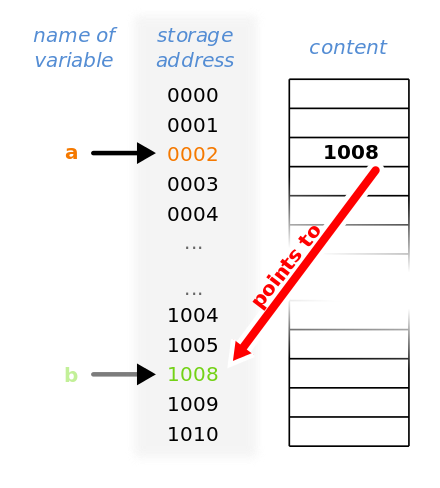

# Pointers

- <https://en.wikipedia.org/wiki/Pointer_(computer_programming>)
- <https://go.dev/tour/moretypes/1>
- <https://www.geeksforgeeks.org/pointers-in-golang/>
- <https://www.programiz.com/golang/pointers>
- <https://www.golang-book.com/books/intro/8>

## What is a pointer

Accordingly to [Wikipedia](https://en.wikipedia.org/wiki/Pointer_(computer_programming)):

In computer science, a pointer is an object in many programming languages that stores a memory address. This can be that of another value located in computer memory, or in some cases, that of memory-mapped computer hardware. A pointer references a location in memory, and obtaining the value stored at that location is known as dereferencing the pointer. As an analogy, a page number in a book's index could be considered a pointer to the corresponding page; dereferencing such a pointer would be done by flipping to the page with the given page number and reading the text found on that page. The actual format and content of a pointer variable is dependent on the underlying computer architecture.



Using pointers significantly improves performance for repetitive operations, like traversing iterable data structures (e.g. strings, lookup tables, control tables and tree structures). In particular, it is often much cheaper in time and space to copy and dereference pointers than it is to copy and access the data to which the pointers point.

Pointers are also used to hold the addresses of entry points for called subroutines in procedural programming and for run-time linking to dynamic link libraries (DLLs). In object-oriented programming, pointers to functions are used for binding methods, often using virtual method tables.

A pointer is a simple, more concrete implementation of the more abstract reference data type. Several languages, especially low-level languages, support some type of pointer, although some have more restrictions on their use than others. While "pointer" has been used to refer to references in general, it more properly applies to data structures whose interface explicitly allows the pointer to be manipulated (arithmetically via pointer arithmetic) as a memory address, as opposed to a magic cookie or capability which does not allow such.[citation needed] Because pointers allow both protected and unprotected access to memory addresses, there are risks associated with using them, particularly in the latter case. Primitive pointers are often stored in a format similar to an integer; however, attempting to dereference or "look up" such a pointer whose value is not a valid memory address could cause a program to crash (or contain invalid data). To alleviate this potential problem, as a matter of type safety, pointers are considered a separate type parameterized by the type of data they point to, even if the underlying representation is an integer. Other measures may also be taken (such as validation & bounds checking), to verify that the pointer variable contains a value that is both a valid memory address and within the numerical range that the processor is capable of addressing.

## Pointers in Go

Source: <https://go.dev/tour/moretypes/1>

Go has pointers. A pointer holds the memory address of a value.

The type `*T` is a pointer to a `T` value. Its zero value is `nil`.

```go
var p *int
```

The `&` operator generates a pointer to its operand.

```go
i := 42
p = &i
```

The `*` operator denotes the pointer's underlying value.

```go
fmt.Println(*p) // read i through the pointer p
*p = 21         // set i through the pointer p
```

This is known as "dereferencing" or "indirecting".

**NOTE**: Unlike C, Go has no pointer arithmetic.

```go
i, j := 42, 2701

p := &i         // point to i
fmt.Println(*p) // read i through the pointer
*p = 21         // set i through the pointer
fmt.Println(i)  // see the new value of i

p = &j         // point to j
*p = *p / 37   // divide j through the pointer
fmt.Println(j) // see the new value of j
```

## Why do we need pointers?

Usually it is better to use [pure functions](https://en.wikipedia.org/wiki/Pure_function), but sooner or later we have to modify memory state:

```go
func assignValue(x int)   { x *= 10 }
func assignPValue(x *int) { *x *= 10 }
func main() {
  i := 123
  fmt.Println(i) // OUtput: 123
  assignValue(i)
  fmt.Println(i) // Output: 123
  assignPValue(&i)
  fmt.Println(i) // Output: 1230
}
```

Btw, a pure function example would look like this (but we need to understand pointers):

```go
func value(x int) int { return x * 10 }
func main() {
  const i = 123
  j := value(i)
  fmt.Println(j) // Output: 1230
}
```

## How can we create pointers?

```go
x := int
p1 := &x
*p1 = 123

p2 := new(int)
*p2 = 123

type s struct { n int }

p3 := &s{123} // or p3 := &s{n: 123}

p4 := new(s)
p4.n = 123 // Go automaticaly dereferences pointers to structures.
```

## Implicit references in Go

implicit /ɪmˈplɪsɪt/

_adjective_

1. suggested though not directly expressed.
2. always to be found in; essentially connected with.

There are a few data types in Go that are references by their nature:

1. Pointers (lmao)
2. [Slices](https://pkg.go.dev/reflect#SliceHeader)

   ```go
   type SliceHeader struct {
     Data uintptr
     Len  int
     Cap  int
   }
   ```

3. [Strings](https://pkg.go.dev/reflect#StringHeader)

   ```go
   type StringHeader struct {
     Data uintptr
     Len  int
   }
   ```

4. Maps: These are a bit complicated <https://www.youtube.com/watch?v=Tl7mi9QmLns>
5. Functions: Remember GioUI's [layout.Widget](https://pkg.go.dev/gioui.org/layout#Widget)? It's a function:

   ```go
   // Widget is a function scope for drawing, processing events and computing
   // dimensions for a user interface element.
   type Widget func(gtx Context) Dimensions
   ```

### Slices are references

```go
func change(x []int) { copy(x[1:3], []int{11, 22}) }
func main() {
  x := []int{1, 2, 3, 4, 5}
  change(x)
  fmt.Println(x) // Output: [1 11 22 4 5]
}
```

### StringHeader

```go
x := [...]byte{'h', 'e', 'l', 'l', 'o'}
var s string
hdr := (*reflect.StringHeader)(unsafe.Pointer(&s))
hdr.Data = uintptr(unsafe.Pointer(&x))
hdr.Len = len(x)
fmt.Println(s)  // Output: hello
```
